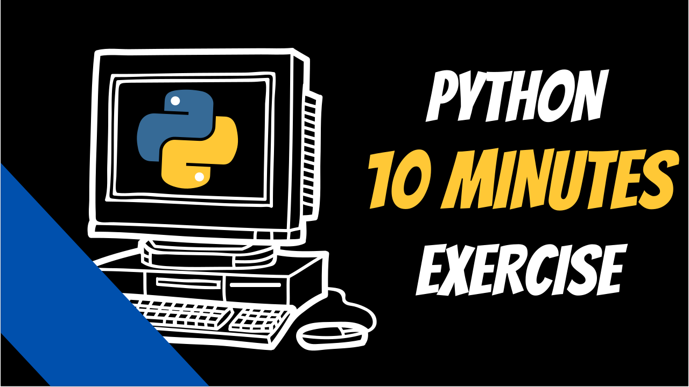

   

---

Learning coding can be frustraiting especially if you are doing it alone, this repo helps you exactly with that 💪 !!!

Here at `./exercises` you can find many exercises which are perfect to start with because:

- **Pair programming**: a video tutorial explaining the code step by step for each exercise
- **Fast**: not an entire night or afternoon to get it done but just 10 minutes
- **Simple**: not too many stuff at once, a new bit everytime 
- **Incremental**: enjoyed the exercise ? don't stop here and complete the followup tasks

## Video Tutorials

| Number  | Title | Link  |
| :-----: | :---: | :---: |
| 1 | Guess Number Game  | https://www.youtube.com/watch?v=BRmmzlzqfyY |
